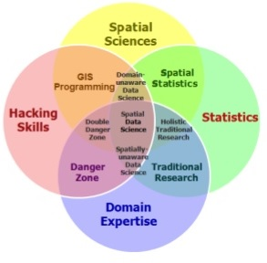
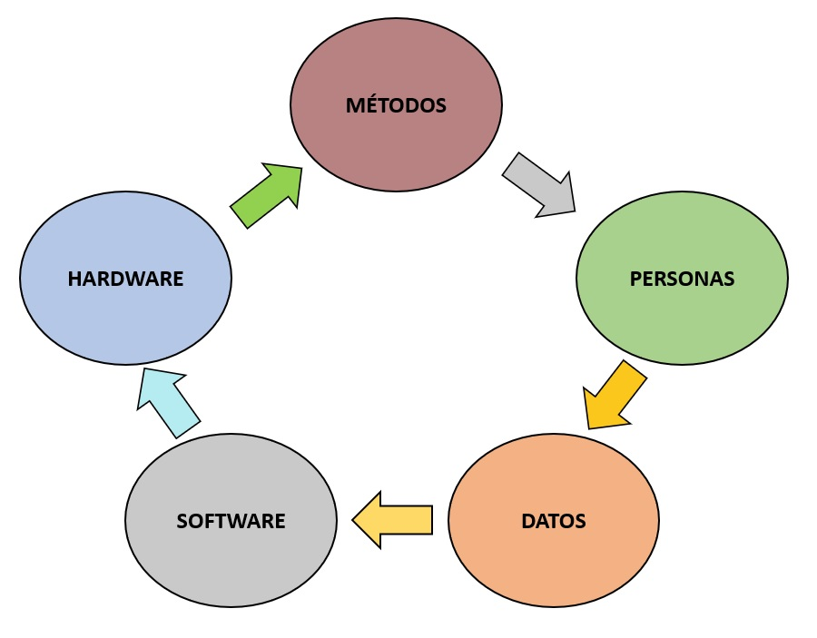
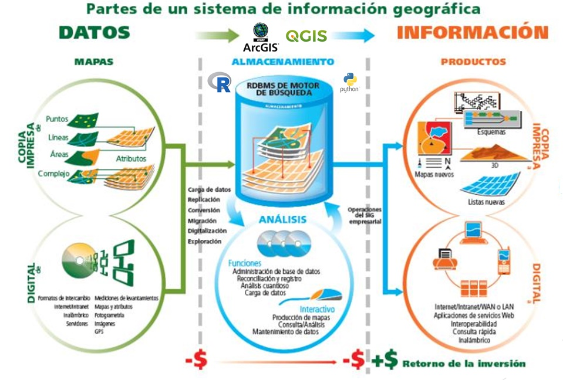
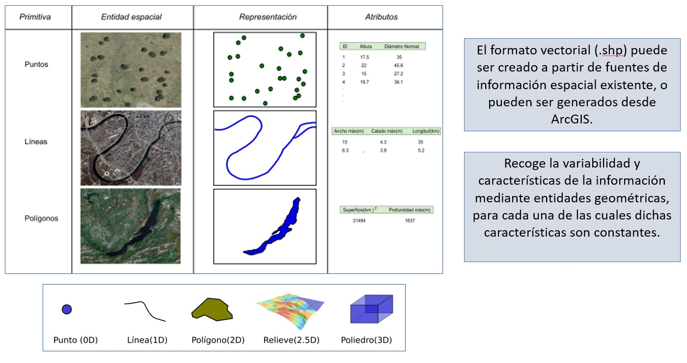
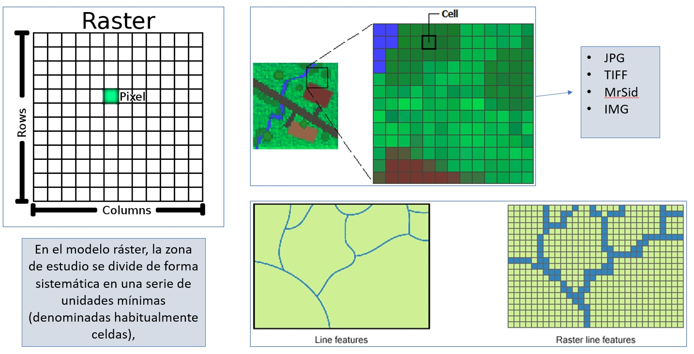

```{r setup, include=FALSE}
knitr::opts_chunk$set(echo = FALSE)
```
<script src="https://ajax.googleapis.com/ajax/libs/jquery/3.1.1/jquery.min.js"></script>

<style>

  .col2 {
    columns: 2 200px;         /* Numero de columnas y tamaño de pixeles de columna*/
    -webkit-columns: 2 200px; /* chrome, safari */
    -moz-columns: 2 200px;    /* firefox */
  }
  .col3 {
    columns: 3 100px;
    -webkit-columns: 3 100px;
    -moz-columns: 3 100px;
  }
  
.zoomDiv {
  opacity: 0;
  position:absolute;
  top: 50%;
  left: 50%;
  z-index: 50;
  transform: translate(-50%, -50%);
  box-shadow: 0px 0px 50px #888888;
  max-height:100%; 
  overflow: scroll;
}

.zoomImg {
  width: 100%;
}
</style>

<script type="text/javascript">
  $(document).ready(function() {
    $('slides').prepend("<div class=\"zoomDiv\"></div>");
    // onClick function for all plots (img's)
    $('img:not(.zoomImg)').click(function() {
      $('.zoomImg').attr('src', $(this).attr('src'));
      $('.zoomDiv').css({opacity: '1', width: '60%'});
    });
    // onClick function for zoomImg
    $('img.zoomImg').click(function() {
      $('.zoomDiv').css({opacity: '0', width: '0%'});
    });
  });
  
</script>

## INTRODUCCIÓN {.build}


* R es un entorno y lenguaje de programación ampliamente usado en la ciencia de datos, principalmente en el análisis estadístico. 

* La relación de R con el análisis de datos espaciales se evidencia ampliamente en la gran cantidad de paquetes modulares que se usan con este fin. 

## OBJETIVOS {.build}

El objetivo del presente curso es proporcionar los conocimientos básicos para empezar a trabajar con el lenguaje de programación R, enfocado a su uso como herramienta principal en los Sistemas de Información Geográfica (GIS) y el análisis espacial de datos.

<center>  </center>


## REVISIÓN LITERARIA 

## ¿QUÉ ES UN GIS? 

<center>  </center>

## ¿QUÉ ES UN GIS?

<center>  </center>

## REPRESENTACIÓN VECTORIAL 

<center>  </center>

## REPRESENTACIÓN RASTER 

<center>  </center>

## ¿QUÉ ES LA CIENCIA DE DATOS? 

* La Ciencia de Datos es un área de trabajo interdisciplinar que incluye procesos para recopilar, preparar, analizar, visualizar y modelizar datos que permitan generar conocimiento útil para comprender problemas complejos y ayudar en la toma de decisiones (Casillas 2016).  


* Un científico de datos es aquella persona con dominio en matemáticas, estadísitica, computación y tecnología, perfilandose actualmente como una de las profesiones del futuro (Good Rebels).


## ¿QUÉ ES R?

* R fue creado en 1992 en Nueva Zelanda por Ross Ihaka y Robert Gentleman basandose en la sintaxis del **lenguaje S** desarrollado principalmente por John Chambers en Bell Laboratories y **Scheme** desarrollado por por Guy L. Steele y Gerald Jay Sussman (Ihaka 1998).

* R es un lenguaje de programación interpretado, de **distribución libre**, bajo Licencia GNU, y se mantiene en un ambiente para el cómputo estadístico y gráfico, actualmente ampliamente aplicado para el procesamiento de datos en ciencias (Santana y Farfán 2014).

* R no es un sistema estadístico sino un ambiente en el que se aplican técnicas estadísticas, este software corre en distintas plataformas Linux, Windows, MacOS, e incluso en PlayStation 3 (Santana y Farfán 2014).


## CARACTERISTICAS DE R

* El sistema R esta dividido en dos partes conceptuales: El sistema base de R, que es el que puedes bajar de CRAN, y en todo lo demás, principalmente **paquetes** modulares. 

* La capacidad de gráficos de R es muy sofisticada. Existe paquetería para **graficar, crear y manejar shapefiles**; manipular y crear datos en distintos formatos como **netCDF, csv, xlsx, tiff, etc**.

<center>  </center>

## ¿QUÉ ES RStudio?

* RStudio es un entorno de desarrollo integrado (IDE) para el lenguaje R, disponible para Windows, Mac, Linux y en casi **todos los sistemas operativos**.

* Algunas ventajas de usar **RStudio** son : es **libre**, nos permite abrir varios scripts a la vez,  nos permite ejecutar pedazos de código de los scripts, disponibilidad de autocompletado de código, etc.

* Se puede descargar desde los siguientes enlaces : [R v3.5.2](https://cran.r-project.org/bin/windows/base/release.htm) y [RStudio](https://download1.rstudio.org/RStudio-1.1.463.exe)

<center>  </center>

## CARACTERÍSTICAS DE RSTUDIO

<center>  </center>


## PAQUETES DE R 

Función | Acción
------------ | -----------------------------------------
library() | Lista de paquetes instalados
install.packages("Nombre_del_paquete") | Instalación de un paquete
library(Nombre_del_paquete) | Cargar un paquete a la sesión
search() | Lista de paquetes instalados y cargados a la sesión
.libPaths() | Directorio en el que 'R' almacena y busca los paquetes

***

<center>  </center>

## AYUDA EN R

R dispone de un buen **sistema de ayuda** , lo que nos ayudará a obtener información de cualquier función en específico, caracter o palabra.

Función | Acción
------------ | -----------------------------------------
help() | Muestra una ventana de ayuda general sobre 'R'
help.start() | Arranca un manual de ayuda completo en formato html, utilizando el navegador del sistema
help(Nombre) o ?Nombre | Muestra una ventana de ayuda sobre una función 
help.search("Nombre") | Muestra un listado de contenidos acerca de una función, caracter y palabra

## SINTAXIS DE R

### EJEMPLO DE UN COMENTARIO : 

```{r , echo = TRUE }
# LOS COMENTARIOS EN "R" EMPIEZAN CON EL CARÁCTER '#'
# -----------------------------------------------------

```
### LA FORMA EN LA QUE SE ASIGNA UN VALOR A UNA VARIABLE ES:

```{r , echo = TRUE }

u <- 5

```

### LA FUNCIÓN 'print' NOS AYUDARA A IMPRIMIR EL VALOR DE LA VARIABLE EN LA CONSOLA:

```{r , echo = TRUE }
print(u) 

```
***
### TAMBIÉN SE PUEDE IMPRIMIR SU VALOR DIGITANDO LA VARIABLE : 

```{r , echo = TRUE }
u
```
### 'R' FUNCIONA COMO UNA CALCULADORA, EJEMPLO :

```{r , echo = TRUE }
((5*5+3+5)^2) + 5/2

log((1/pi)* 5) #Logaritmo neperiano

```
***
```{r , echo = TRUE }

v <- 1/Inf #Divide un número por Infinito
v

w <- 0/0 ; v # Indeterminado

p = 758.9 # Presión en mmHg
patm = p*(1/760.0021) ; patm # Presión en atmósferas

```

## OPERACIONES MATEMÁTICAS EN R

<center>  </center>

## TIPOS DE DATOS EN R

* Todas las cosas que manipula R se llaman objetos, por ello se dice que **R esta orientado a objetos** (Santana y Farfán 2014).

* Los objetos son **estructuras que combinan datos y funciones** que operan sobre ellos y son muy útiles en un entorno como R (Gil 2018).

* En general, cada tipo de objeto viene definido por una serie de atributos. Las funciones genéricas (como por ejemplo *summary* o *plot*) reconocen estos atributos y llevan a cabo distintos tipos de acciones en función del tipo de objeto (Amazon AWS 2019).


## TIPOS DE DATOS EN R

Clases atómicas | Descripción | Ejemplo
------------ | ------------ | ------------
Character | Cadenas de caracteres | cimma <- "minería"
Numeric | Números reales | g <- 9.8
Integer | Números enteros | edad <- 20L
Complex | Números complejos | u <- 5 + 2i
logical | Lógicos o booleanos | v <- FALSE
NA | Datos perdidos o faltantes | w <- NA
NaN | Datos indeterminados | z <- NaN

## ESTRUCTURA DE DATOS EN R

Objetos | Tipos | Varios Tipos
------------ | ------------ | ------------
Vector | Numérico, caracter, complejo o lógico | NO
Factor | Numérico o caracter | NO
Array | Numérico, caracter, complejo o lógico | NO
Matrix | Numérico, caracter, complejo o lógico | NO
Data frame | Numérico, caracter, complejo o lógico | SI
ts | Numérico, caracter, complejo o lógico | SI
List | Numérico, caracter, complejo, lógico, función, expresión, etc. | SI

## ESTRUCTURA DE DATOS EN R

<center>  </center>

## VECTOR

* Cada uno de las clases de **objetos más simples o *atómicas* ** no se encuentran ni se manejan de manera aislada, sino encapsulados dentro de la clase de objeto más básica del lenguaje R: **el vector** (Santana y Farfán 2014).

* Un **vector** puede contener cero o más objetos, pero todos de la misma clase (Santana y Farfán 2014).

<center>  </center>

***

```{r , echo = TRUE , collapse = TRUE}

c(5,7,9,-15) # Creación de un vector sin asignarlo a una variable

u <- c(5,7,9,-15) # Creación de un vector asignandolo a una variable
card <- c("E","W","N","S")

assign("w", c(5,7,9,-15)) # La función 'assign' asigna un vector a una variable
```

```{r , echo = TRUE, collapse = TRUE}

print(u); print(v) ; print(w)

```

*NOTA: La impresión del vector se hace en un renglón que comienza con el símbolo ’[1]’, indicando con ello que el primer elemento del renglón corresponde al primer elemento del vector.*

***
### CREACIÓN DE VECTORES A PARTIR DE PATRONES O SECUENCIAS :

```{r , echo=TRUE, collapse= TRUE}

v <- vector("integer", 0)
v # Un vector de enteros sin elementos

w <- vector("numeric", 5)
w # Un vector de tres ceros
```

### EL OPERADOR ’:’ GENERA UN VECTOR A PARTIR DE UNA SECUENCIA DE ENTEROS :
  
```{r , echo=TRUE, collapse= TRUE}
x <- 50:80 ; y = pi:7
print(x); class(x) ; print(y) 

```
***
### LA FUNCIÓN *seq()* PERMITE GENERAR MAYOR VARIEDAD DE SECUENCIAS NUMÉRICAS :

```{r , echo=TRUE, collapse= TRUE}

u <- seq(from = 2, to = 19, by = 2)
print(u) # secuencia desde 2 hasta 18 de 2 en 2

v <- seq(from = 3, by = 3, length.out = 8)
print(v) # secuencia de 8 números iniciando desde 3 y de 3 en 3

```

### LA FUNCIÓN *rep()* PERMITE REPETIR UNA SECUENCIA DE NÚMEROS VARIAS VECES :

```{r , echo=TRUE, collapse= TRUE}
v <- c(pi, -3, 1+3i)
w <- rep(v, times = 2)
print(w) ; class(w)
```
***
### LA FUNCIÓN *c()* PERMITE CONSTRUIR VECTORES A PARTIR DE OTROS :
```{r , echo=TRUE, collapse= TRUE}

u <- c(3, 4, 5)
v <- c(5, 4, 3)
w <- c(u, v)
```
### ACCESO A UN ELEMENTO INDIVIDUAL DE UN VECTOR:

```{r , echo=TRUE, collapse= TRUE}

u <- c(18, 75, -2.33, 72)
u[3] # El cuarto elemento

u[4]+u[2] # La suma del cuarto y segundo elementos de 'u'

```
***
### PONER NOMBRES A LOS ELEMENTOS INDIVIDUALES DE UN VECTOR :

```{r , echo=TRUE, collapse= TRUE}

temp <- c(28, 29, 29, 30) #Temperatura ambiente
names(temp) <- c("a", "b", "c", "d")       # OTRA FORMA :  temp <- c(a=28, b=29 ....

temp

temp["b"]

temp["b"] <- 28
temp

```
***
### OPERACIONES MATEMÁTICAS CON VECTORES

```{r , echo=TRUE, collapse= TRUE}
v <- 4 + 34 + 2      # Resulta en un vector de longitud 1
v

v <- c(21, 13) - c(4, 17)     # Resulta en un vector de longitud 2
v

v <- c(2, 3, 4) * c(2, 1, 3)     # Resulta en un vector de longitud 3
v

v <- c(1, 2, 3, 4)^(4:1)     # Eleva a potencias 4,3,2,1
v

```
***

### MANEJO DE FUNCIONES TRIGONOMÉTRICAS

```{r , echo=TRUE, collapse= TRUE}

# Para obtener el seno de 30, 45 y 60 grados:

# Primero se hace la conversión a radianes

angulos <- c(30, 45, 60) * (pi/180)
angulos # En radianes

# Luego se aplica la función trigonométrica
# sin() , cos() , tan() ....

senos <- sin(angulos)
senos

```
## MATRIZ

* Es una estructura de datos **bidimensional** (DATAMENTOR 2018).

* La matriz es similar al vector,  pero adicionalmente contiene el atributo: ***dim*** (dimensión) (DATAMENTOR 2018). Este atributo es un vector entero de dos elementos : el número de renglones y el número de columnas que componen a la matriz (Santana y Farfán 2014).

<center>  </center>

## ARRAY

* Un **Array** es una **estructura de datos**. Puede ser de **1D** (por ejemplo, números, cadenas, etc.), **2D** (por ejemplo, información de color de píxeles de una imagen), **3D** (por ejemplo, tabla de datos) o cualquier **n Dimensiones** (QUORA 2015). 

* Se crea utilizando la función *array ()*, usando vectores como entrada y el parámetro *dim*.

<center>  </center>

***
```{r , echo=TRUE, eval= FALSE}
# CREACIÓN DE DOS VECTORES DE DIFERENTES LONGITUDES
vector1 <- c(54,-8,4)
vector2 <- c(1,7,18,14,-4,15.5)
column.names <- c("COL1","COL2","COL3")
row.names <- c("ROW1","ROW2","ROW3")
matrix.names <- c("Matrix1","Matrix2")

# LOS VECTORES ANTERIORES SERÁN LA ENTRADA DE NUESTRO 'ARRAY'
result <- array(c(vector1,vector2),dim = c(3,3,2),
          dimnames = list(row.names,column.names,matrix.names))

print(result)
```
***

<div class="col2">

### IMPRESIÓN DEL *ARRAY* :

```{r , echo= FALSE, collapse= TRUE}
vector1 <- c(54,-8,4)
vector2 <- c(1,7,18,14,-4,15.5)
column.names <- c("COL1","COL2","COL3")
row.names <- c("ROW1","ROW2","ROW3")
matrix.names <- c("Matrix1","Matrix2")

# LOS VECTORES ANTERIORES SERÁN LA ENTRADA DE NUESTRO 'ARRAY'
result <- array(c(vector1,vector2),dim = c(3,3,2),
          dimnames = list(row.names,column.names,matrix.names))

print(result)

```
<center>  </center>

</div>

***

### CONSTRUCCIÓN DE MATRICES :

```{r , echo=TRUE, collapse= TRUE}

m <- 1:20 # Un vector con 20 números
dim(m) <- c(4, 5) # 4 renglones y 5 columnas
class(m); m

#LAS DIMENSIONES TAMBIÉN SE PUEDEN CAMBIAR
dim(m) <- c(5, 4) ; m

```
***

```{r , echo=TRUE, collapse= TRUE}

#SELECCIÓN DE UN ELEMENTO (FILA Y COLUMNA)
 m[4,2]
#SELECCIÓN DE UN ELEMENTO (POR POSICIÓN)
m[7]
#SELECCIONAR LOS ELEMENTOS DE UNA COLUMNA O FILA
m[3, ] 

m[,3 ]

class(m[, 3])

```
***

```{r , echo=TRUE, collapse= TRUE}
#ASIGNAR NOMBRES A FILAS Y COLUMNAS
rownames(m) <- c("uno", "dos", "tres", "cuatro", "cinco")
colnames(m) <- c("a", "b", "c", "d") ; m

n <- matrix(1:12, nrow = 3, ncol = 4, byrow = TRUE)
n
```
***

### LAS FUNCIONES *rbind()* y *cbind()* SE PUEDEN UTILIZAR PARA CONSTRUIR MATRICES :
```{r , echo=TRUE, collapse= TRUE}
u <- rbind(c(1.5, 3.2, -5.5), c(0, -1.1, 60))
u
```
### UNA MANERA FÁCIL DE CREAR MATRICES : 

```{r , echo=TRUE, collapse= TRUE}
v <- matrix(1:6, 3, 2) ; v

```
***

### LA MULTIPLICACIÓN MATRICIAL SE HACE CON EL OPERADOR '%*%' :

```{r , echo=TRUE, collapse= TRUE}
n <- matrix(1:6, 3, 2)
m <- rbind(8:10, 10:12)
x <- n%*%m

#LA TRANSPUESTA DE LA MATRIZ 'x' SE OBTIENE CON 't(A)'
t(x)

```
***

## CARACTERES

* En R, las cadenas de caracteres son **vectores** utilizados para nombrar objetos (Santana y Farfán 2014).

* Un fragmento de texto se representa como una secuencia de caracteres (letras, números y símbolos) (Sánchez 2019).

```{r , echo=TRUE, collapse= TRUE}
persona <- c("Hugo", "Mario", "Luis")
meses<- c("Dic", "Feb", "Oct")
paises <- c("Brasil","Perú","Colombia")
gasesdeefec <- c( "CO2", "CH4" , "N2O", "CFC")

```

## FACTORES

* Un factor puede considerarse como una *estructura de información*, a la que se puede someter a algún tipo de procesamiento estadístico, cuyo núcleo son dos vectores: **los niveles (*levels*) y un vector de índices enteros** (Santana y Farfán 2014).

* En R, se utilizan habitualmente para realizar clasificaciones de los datos, estableciendo su pertenencia a los grupos o categorías determinados por los *levels* (Santana y Nieves 2014).

* Los niveles de un factor puede estar codificados como valores numéricos o como caracteres (Santana y Nieves 2014). 

***
### TRANSFORMAMOS EL VECTOR A FACTOR MEDIANTE LA FUNCIÓN 'as.factor()'

```{r , echo=TRUE, collapse= TRUE}
sexo <- c("M", "H", "H", "M", "H", "H", "H", "M", "H", "M")
sexo <- as.factor(sexo) ; sexo

#COMO SE PUEDE VER EL NÚCLEO DE LA CLASE SON DOS VECTORES :
unclass(sexo)
```

### LA FUNCIÓM 'table()' NOS DA COMO RESULTADO LA FRECUENCIA DE APARICIÓN:

```{r , echo=TRUE, collapse= TRUE}
table(sexo)
```
***
### SE PUEDE ESTABLECER UN ORDEN DETERMINADO DE LOS NIVELES:

```{r , echo=TRUE, collapse= TRUE}
mesdenac <- c("Dic", "Feb", "Oct", "Mar", "Feb", "Nov","Abr", "Dic", "Feb", "Oct")
meses <- c("Ene","Feb","Mar","Abr","May","Jun","Jul","Ago", "Sep","Oct","Nov","Dic")

m <- factor(mesdenac, levels= meses) ; m

levels(m)[2] <- "marzo" ; m

```
<center>  </center>

## LISTAS

* Una lista es una clase de datos que puede contener cero o más elementos, cada uno de los cuales puede ser de una **clase distinta** (Santana y Farfán 2014).

* Al igual que los vectores, **los elementos de la lista pueden ser nombrados**, lo que añade mayor claridad a su significado (Santana y Farfán 2014).

<center>  </center>

***
### CONSTRUCCIÓN DE UNA LISTA QUE REPRESENTE UNA FAMILIA:
```{r , echo=TRUE, collapse= TRUE}
listfam<- list(hombre = "Juan", mujer = "Sonia", casados = TRUE, numero.hijos = 3, nombre.hijos=c('Hugo', 'Paco', 'Mary'))
listfam
```
***
### UNA LISTA PUEDE CONTENER OTRA LISTA: 
```{r , echo=TRUE, collapse= TRUE}
l1 <- list(nombre= "Marcos",nacimiento= 1986) ;  l2 <- list(nombre= "Juan", DNI = 46174852)
l3 <- list(l1,l2) ; l3
```

## DATAFRAME

* Un *dataframe* es una lista, cuyos componentes pueden ser vectores, matrices o factores, con la única salvedad de que las longitudes deben coincidir en todos los componentes (Santana y Farfán 2014).

* La estructura de un *dataframe* es muy similar a la de una matriz, La diferencia es que una matriz sólo admite valores numéricos, mientras que en un *dataframe* podemos incluir también datos alfanuméricos (Santana y Nieves 2014).

<center>  </center>


